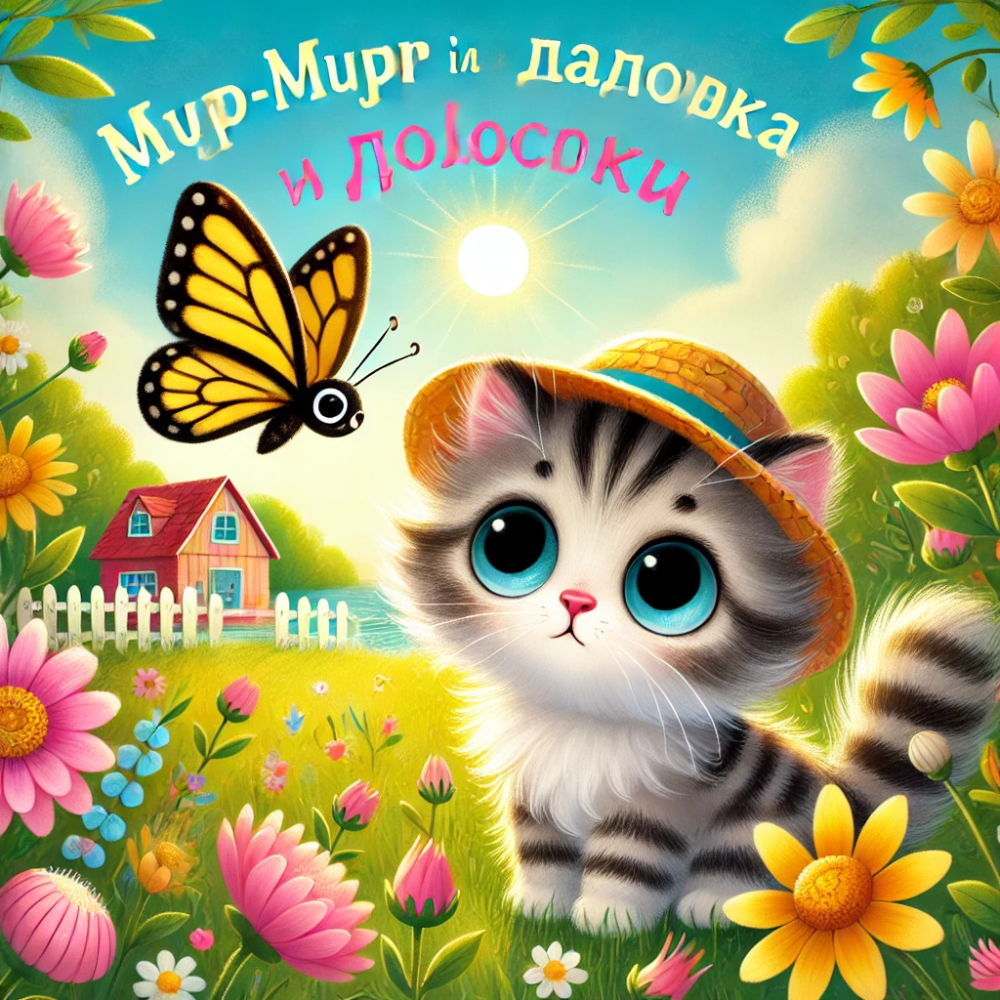

### **Lugu 1: Murr-murr ja triibuline liblikas**  

Ühel hommikul paistis Murr-taunis päike ja õhus hõljus värskete kalapirukate lõhn — ema Murrka oli need just ahjust välja võtnud.  
Suures majas järve ääres oli elevust täis sagimist: kassipojad jooksid ringi, hüppasid patjadelt ja ehitasid klotsidest torne.

Aga väike Murr-murr tahtis midagi... erilist.

— Emmeee, kas ma võin aeda minna? Ma olen väga-väga ettevaatlik! — nurrus ta, tõmmates juba oma väikest õlgkübarat pähe.

— Ainult mitte kaugele ja ära pane käpakesi tiiki! — hüüdis ema köögist, kui ta oma kohevate käppadega lauda pühkis.

Murr-murr lipsas uksest välja ja nägi teda — **liblikat**! See oli triibuline, kollane ja must nagu lendav sallike.  
Ta liugles lillede kohal ja... tõusis äkitselt õhku!

— Oodaaaake! — hüüdis Murr-murr ja tormas talle järele.

Ta jooksis mööda teerada, hüppas üle kännu, põikas läbi juurte ja... jõudis aianurka, kus ta **pole kunagi varem käinud.**

Rohus seisis **väike kõrvitsamaja**.

— Mjäu? — küsis Murr-murr vaikselt.

Majakesest piilus välja **tigu prillidega**.

— Tere! Kes sina oled? — küsis ta peenikese häälega. — Mina olen Ulimups, Võlurohu raamatukoguhoidja. Aga sina?

— Ma jooksin liblika järel… ja vist eksisin ära, — sosistas Murr-murr, ringi vaadates.

— Pole hullu! — naeratas Ulimups. — Ma tean otseteed tagasi. Aga tahad enne mu seemnekogu näha?

Murr-murr noogutas. Ta veetis **viis kassiminutit** Ulimupsi juures, vaadates seemneid, kuuldes lugusid rohulehtedest ja maitstes tillukesi meeküpsiseid.

Siis näitas Ulimups talle rada, mis viis otse tagumise väravani.

Kui Murr-murr koju jõudis, ootas ema teda juba ukse juures.

— Kus sa olid, mu väike käpake? Ma juba muretsesin!

— Ma kohtusin Ulimupsiga! Ta elab kõrvitsamajas ja kogub lugusid rohust! — säras Murr-murr.

— Ah, see peab olema seesama Ulimups, kellest su vanaema rääkis, — ütles ema Murrka naeratades. — Nii et sa avastasid täna aia esimese võlupaiga...

Murr-murr naeris ja puges emme vastu.

Ja triibuline liblikas lendas uuesti mööda… ja pilgutas talle silma.
