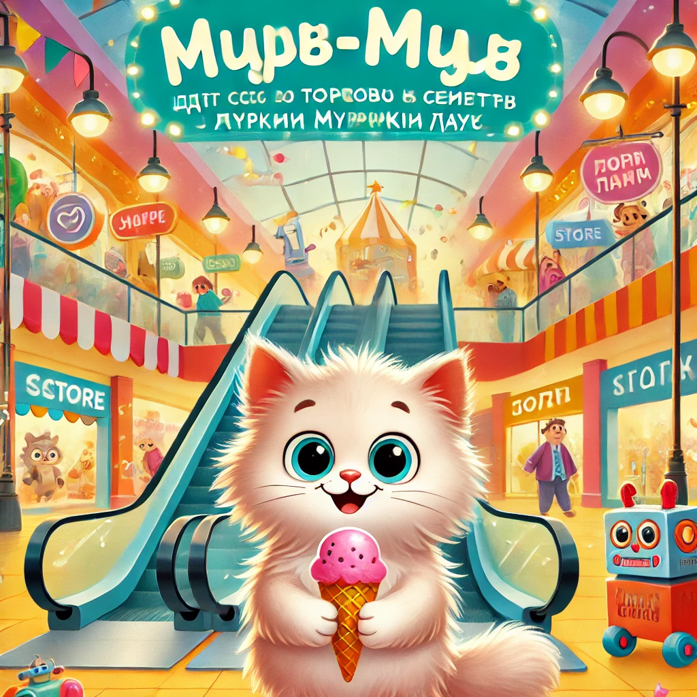

### **Lugu 10: Murr-murr Murrkin Hauses**  

Pühapäeva hommikul lõhnas maja vanillise seebi järele — kõik valmistusid **sõiduks Murrkin House’i**, suurimasse kaubanduskeskusesse kogu Murr-tauni kandis.

— Meil on tähtis missioon! — kuulutas isa Murr, valides lipsu kaladega. — Vajame talvekindaid, uut termoset ja… torti!

— Ja natuke mõnusat nurrlemist ka, — muigas ema Murrka, klammerdades ostunimekirja.

— Ja mina tahan mänguasjapoodi! Seal on ju **RoboKass-3000!** — kilkas Murr-murr, tehes paar rõõmupöördeid.

---

Murrkin House oli **meeletult suur**.  
Liikuvad trepid, sildid, värvilised letid:  
**"Käppastiil"**, **"Murr-jäätis"**, **"Kassiraamatud"**, **"Mängi-Hau!"**…

Murr-murr hoidis ema käpast kinni, suu lahti ja silmad nagu kaks kuuplaadist valmistatud kraani.

Ta proovis mütsi **kõrvadega**, nägi **vahukomme silmadega**, ja siis lõpuks…

— Vaaau! Seal ta on! RoboKass-3000!

Robot nurrus ja ütles:

— Tere, Murr-murr. Olen valmis nurrumängudeks!

---

Aga siis, kui kogu pere läks raamatupoodi, **jäi Murr-murr üksi**, sest jäi liiga kauaks vitriini vahtima.  
Ta vaatas ringi… ja ei näinud ema ega isa.

— Mjäu?… — ütles ta tasakesi.

Inimesed liikusid, valgus sähvis, keegi naeris…  
Südames hakkas kripeldama.

Aga siis meenus talle ema õpetus:  
**“Kui sa kaotad meid ära — ära jookse. Otsi abi.”**

---

Murr-murr sammus julgelt **infoleti** juurde, kus istus suur **koer Bobo** sinise vormi ja tähekujuline mütsiga.

— Vabandage… Ma vist eksisin ära…

Bobo naeratas:

— Ära muretse, pisike. Meil käib neid nurrikuid igal tunnil. Kohe teeme kuulutuse.

Peagi kõlas valjuhääldis:

— Tähelepanu! Väike Murr-murr ootab oma peret infoleti juures. Ta on väga vapper ja natuke jäätiseisu.

Ja hetk hiljem jooksis ema Murrka ta juurde, kallistas, paitas ja ütles:

— Sa tegid kõike õigesti, mu väike seikleja! Ma olen sinu üle nii uhke!

---

Pärast seda sai Murr-murr **jäätise topeltkattega** ja **uue raamatu kosmosekassidest**.

— Koju? — küsis isa.

— Äkki… veel üks sõit üles ja alla eskalaatoril? Lihtsalt... paar korda?

Kõik naersid. Ja sõitsid.  
Üles. Alla. Ja veel mõned korrad.

---

Õhtul ütles Murr-murr:

— Täna sain teada, et **kui sa eksid ära — sind leitakse alati üles. Peaasi, et sa jääd rahulikuks ja nurrud tasakesi.**

Ja isa lisas:

— Ja ära lase end segada lendavatest vahukommidest!
