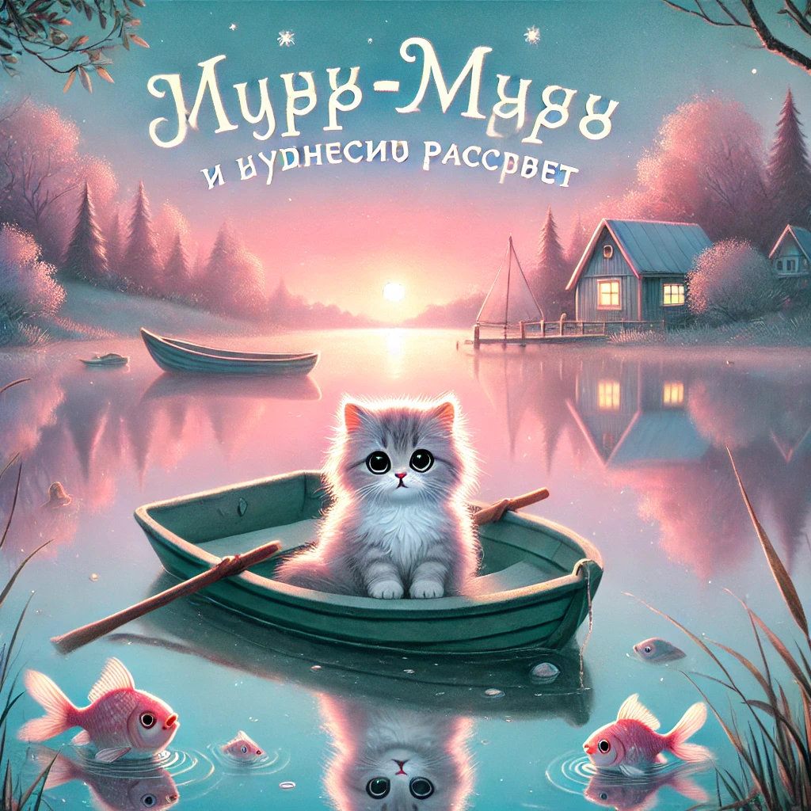

## **Lugu: Murr-murr ja imeline koidik**  

Murr-murr ärkas **väga vara**. Oli juba valge, aga päike polnud veel tõusnud.  
Kõik ümberringi tundus võluväeline — **suvehommik**, täis **kõlavat vaikust**, kus isegi tuul sosistas tasa.

Ta hiilis oma pehmest voodist välja, püüdes mitte äratada ei ema Murrkat, isa, ega vendi ja õdesid.  
Hüpp-hüpp — ja ta oligi juba maja ees, pehme rohu sees.

Tema ees laius **Mjäukolli järv** — sile nagu peegel.  
Kaldal ootas **tema väike paadike**, mis oli köiega vaia külge seotud.  
Murr-murr sidus köie lahti ja lükkas end vaikselt vette.

---

**Taevas oli roosakas-sinine**, ja nägi välja nagu unistus.  
Murr-murr sõudis **otse järve keskele**. Vesi ei lainetanud üldse, ja paat libises vaikselt nagu unes.

Isegi linnud veel ei laulnud.  
Kusagil kauguses krõbistas üksik rohutirts.

— Kui ilus… — sosistas Murr-murr. — See on vist kõige vaiksem hommik maailmas.

---

Ja siis…

*Plumps!*

Veepinnale ilmus **üllatunud kala**, siis veel üks.  
Nad vaatasid Murr-murri nagu küsides:  
— Kes sa oled, et meie hommikuse vaikuse ära rikkusid?

Murr-murr naeratas.

— Ma tulin lihtsalt koos teiega ilu nautima, — ütles ta vaikselt.

---

Aga siis hakkasid hääled ärkama.  
Kõigepealt **akna klõps** kaugelt majast.  
Siis **luua sahin** poe ees.  
Siis — **käpakeste sadu** tänaval.

**Linn ärkas ellu.**

Murr-murr kuulis, kuidas **ema Murrka kutsus** aknast:

— Lapsed, äratus! Hommikusöök on valmis!

Ta pööras paadi ja sõudis kiiresti tagasi kodu poole.

---

Kodu juures ootasid teda **vendad ja õed** — unised, rõõmsad ja pisut sassis.

— Kus sa olid? — küsisid nad.

— Vaatasin, kuidas maailm ärkab, — vastas Murr-murr. — Kõigepealt ta magab peeglis. Aga siis… hakkab naeratama.

Varsti istus kogu pere laua ümber ja Murr-murr sõi oma hommikusööki, rõõmustades, et tema päeva oli juba mahtunud **väike ime**.
