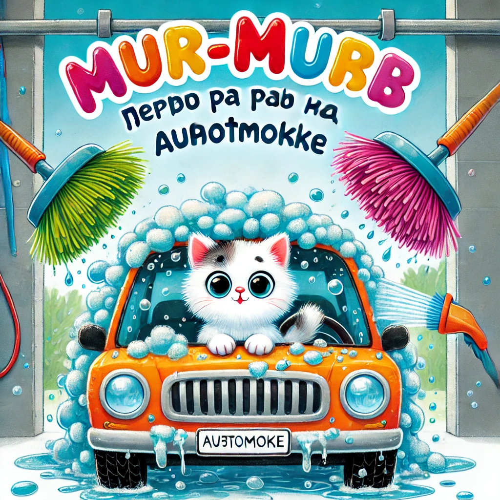

## **Lugu 12: Murr-murr esimest korda autopesulas**  

— Murr-murr, pane müts pähe, me lähme **autopesulasse**! — hüüdis isa Murr, patsutades kõhtu. — Auto näeb välja, nagu oleks üle liiva veerenud!

— Autopesulasse? — küsis Murr-murr, sättides vurre. — Kas see on see koht, kus kõik susiseb, vahutab ja on täis seepi?

— Just! — noogutas isa. — Sa oled täna minu kaaspiloot.

---

Sõit ei olnud pikk, aga **väga põnev**.  
Murr-murr istus tagaistmel, näris kalaküpsist ja vaatas aknast välja, et mitte maha magada **ühtegi autopesulat**.

Ja lõpuks — **seal see oligi!**

Suur klaasist kaar, millel seisis **„MjäuPesu 3000“**.  
Selle ees ootasid autod järjekorras. Sees **väänlesid harjad, pritsis vesi ja kõik säras vahus**.

— Ootame oma järjekorda, — ütles isa. — Varsti läheme sisse!

Murr-murr vajus istmesse.

— See… ei tee haiget, eks? — sosistas ta.

Isa naeratas:

— Üldsegi mitte. See on nagu dušš — ainult autole. Ja väga kohevate harjadega!

---

Järjekord liikus edasi.  
Murr-murr vaatas, kuidas autod **sõitsid sisse** ja kadusid **vahupilve**.  
Sees keerles miski, midagi vilkus, **vett pritsis igast suunast** ja harjad keerlesid nagu suured karvakettad.

Ja siis — **nende kord**.

Auto veeres aeglaselt kaare alla. Murr-murr vajus veel sügavamale istmesse.

— Kõigepealt tuleb vesi. Siis seep. Ja siis oleme läikivad! — rahustas isa.

---

*ŠŠŠ… BZZZZ!*

Veejoa tabamus esiklaasile pani Murr-murri võpatama — aga ainult natuke.

— Kõik korras! — ütles isa rahulikult.

Siis tuli vaht — **valge, roosa, nagu maasikatort**.  
**Suured pöörlevad harjad** hakkasid autot paitama, üle klaasi, katuse ja uste.

— Oo… need on nagu suured karvased käpad! — sosistas Murr-murr.

Vaht voolas alla, ja siis tuli **tuul** — tugev, mullitav, justkui oleks auto sattunud **tormituule tunneli**!

---

— Valmis! — kuulutas isa. — Meie auto särab jälle!

Murr-murr hingas kergendunult välja ja istus uhkemalt.

— See oli natuke hirmus… aga tegelikult lõbus!

— Just. Mõnikord uus asi võib natuke ehmatada, aga koos — pole hullu, — ütles isa ja ulatas talle väikese šokolaadikala.

---

Kui nad koju sõitsid, ütles Murr-murr mõtlikult:

— Issi… kas ma võin ükskord ise roolis olla ja autopesulasse minna?

Isa naeris:

— Muidugi. Kui sa suureks saad. Ja saad oma isikliku nurrulitsentsi!
