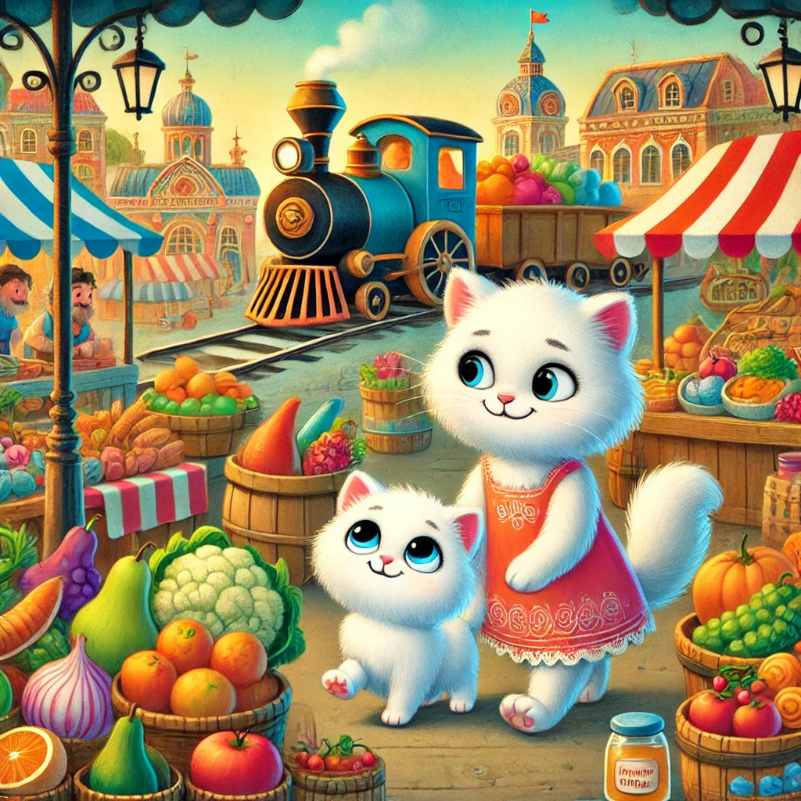

## **Lugu 13: Murr-murr läheb emmega turule oste tegema**  

— Murr-murr, pane müts pähe ja võta korvike, me lähme **turule!** — hüüdis ema Murrka.

— Turule?! Hurraa! — hüppas Murr-murr rõõmust. — Seal, kus lõhnab saiakeste järele ja saab juustu maitsta?

— Just seal, — naeratas ema. — Aga palun, ära kogu aeg kõike käpaga katsuma hakka, eks?

— Ma nuusutan ainult! — lubas Murr-murr ja kihutas ukse poole.

---

**Murr-tauni turg** oli lärmakas, värviline ja täis väikseid imesid.  
Ümberringi kõlas:

— Värske kala! Ainult täna!  
— Meepähklid! Proovige julgelt!  
— Miaubanaanid! Magusad ja mõnusad!

Ema Murrka liikus kindlalt mööda lettide ridasid, Murr-murr aga kõndis kõrval ja keeras pea iga poole:  
**Kassikujuline juust**, **kommikarbi moodi pirn**, **ja seep, mis… piiksus, kui seda nuusutada?!**

— Ema, see turg on nagu muinasjutt! — ohkas Murr-murr.

---

Köögiviljaleti juures nägi Murr-murr **hiiglaslikku arbuusi** ja üritas seda kallistada.  
See kõikus… kõikus… ja—

— ETTEVAATUST! — hüüdis ema.

*PLOKS!* — arbuus kukkus… otse rõõmsameelse müüja käppadesse.

— Kõik hästi! — naeris ta. — Järgmine kord las kallistab tema sind!

Murr-murr punastas ja puges ema korvi varju.

---

Siis läksid nad **vanaisa Mjäukofeile** — ta müüs mett.  
— Tahad natuke pärnaõiemeega lusikatäit? — küsis ta silma pilgutades.

Murr-murr noogutas. Ja see oli **kõige maitsvam mesi maailmas**.

---

Tagasiteel ostis ema **moonisaia**.

— Jagame pooleks? — küsis ta.

— Muidugi! — naeratas Murr-murr. — Pool saia koos emmega on parem kui terve üksi.

---

Kodus, kui nad poekotid lahti pakkisid, ütles ema:

— Sa olid täna väga tubli, Murr-murr.

— Peaaegu ei ajanud midagi ümber! — lisas ta uhkelt.

Ja hiljem jäi ta magama pehmele padjale,  
…ja nägi und arbuusist, kes ise tema kaissu hüppas — ja isegi nurrus.
