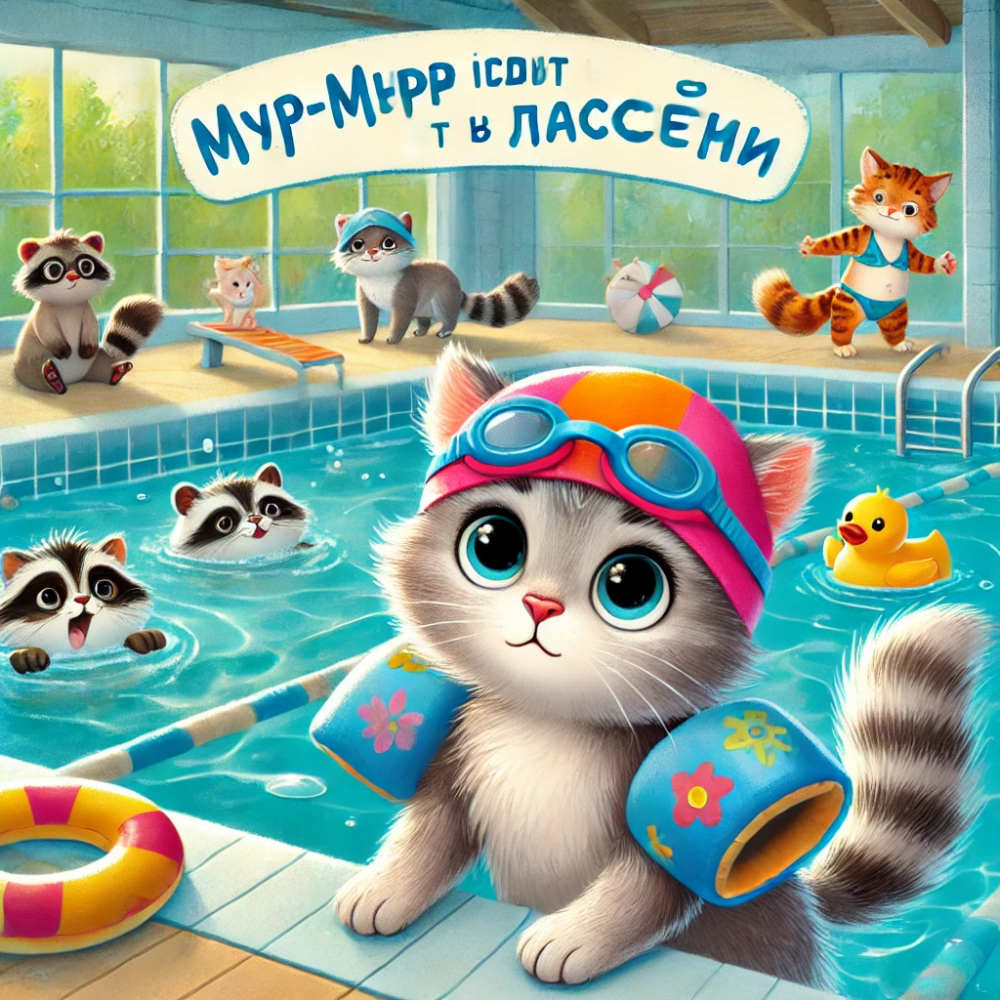

## **Lugu 14: Murr-murr läheb ujulasse**  

— Murr-murr, ärka üles! Täna on **eriline päev!** — hüüdis ema Murrka köögist.  
— Me läheme… **ujulasse!**

Murr-murr tõstis kõrvu.

— Ujulasse? Vee sisse? Päriselt?! — ta jäi hetkeks vait, siis rõõmust hüppas… ja siis jälle jäi vait.  
— Aga seal… peab ujuma? Aga kui ma ära upun?

— Sa ei upu, — ütles ema õrnalt. — Seal on madal vesi, ja mina olen sinuga. Ja issi ka. Ja sul on **kala-kujulised käerauad!**

---

Seljakotti pakkis Murr-murr:  
✔️ rätiku,  
✔️ sussid,  
✔️ prillid (igaks juhuks),  
✔️ ja oma plüüsmerehobukese nimega **Bulli-Bull.**

Kui nad kohale jõudsid, oli ujula **suur** ja **sinine nagu taevas partidega**. Kassid ja kassikesed pladistasid, pritsisid, kilkasid, keegi libistas end mööda veeliugu.

Murr-murr puges ema külje alla.

— Aga äkki vesi on külm? Või… liiga märg?

— Ta on just see — märg, — naeris issi. — Ja sina oled väga vapper!

---

Murr-murr pani ujumismütsi pähe. See oli natuke liiga suur ja vajus silmade peale.

— Sa näed välja nagu meresalat, — muigas isa.  
— Ja sina — nagu merivaal! — itsitas Murr-murr.

Ja siis ta astus vette…

Esmalt ühe käpaga. Siis teisega. Siis põlvini.  
— See on… **soe!** — imestas Murr-murr.

Ja siis — **plärts!** — oli ta vees, kõrvuni, ema kõrval, ja käerauad hoidsid teda vee peal.

---

Varsti ta juba sukeldus, tõi põhjast mängudelfiini ja naeris nii valjusti, et isegi vana päästjämäger naeratas.

— Ema! Issi! Vaadake! Ma olen nurr-delfiin!

— Ja mina — nurr-krabi! — hõikas isa, valades kõigile mängukastmõõgast vett pähe.

---

Kui oli aeg välja tulla, ütles Murr-murr:

— Võib veel natuke? Ainult üks tiir?

— Me tuleme kindlasti veel, — lubas ema, mässides ta **karvasesse rätikusse, kus olid karbid peal.**  
— Sa olid täna tõeline kassipojast ujuja!

— Murr-murr-vann! — naeris ta.

---

Õhtul, juba uinakule vajudes, sosistas ta:

— Emme… kas unes võib ka ujuda?

— Muidugi. Ja ilma mütsita, — vastas ema ja suudles teda märjale ninanupsule.
