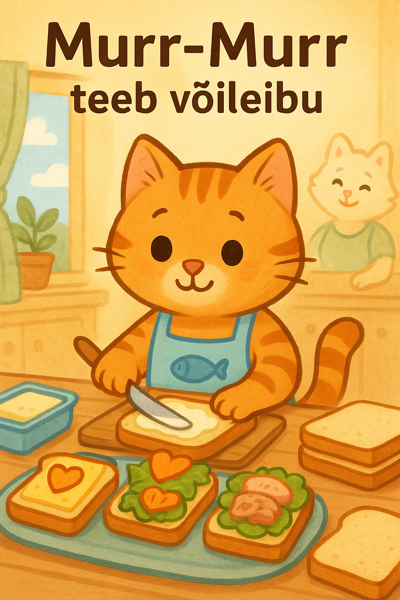

## **Lugu 16: Murr-murr teeb võileibu**  

Ühel päikeselisel nädalavahetusel ärkas Murr-murr **kõigist varem**.  
Ta sirutas end, sügas kõrva tagant ja kuulis köögist tuttavat **vee mulinat** — ema Murrka keetis teed.

— Tere hommikust, mu sabake! — ütles ema. — Täna sööme hommikuks võileibu!

— Kas ma tohin aidata? — küsis Murr-murr, hüpates juba taburetile.

Ema üllatus, aga noogutas.

— Muidugi võid! Aga tead — kokkamine on mitte ainult maitsev, vaid ka **täpne ja rahulik töö**.

— Ma olen väga tõsine kass! — kuulutas Murr-murr ja sidus ette põlle, millel oli **kala pilt**.

---

Ema näitas kõigepealt, **kuidas pehmelt määrida võid** leivale.

— Ära suru liiga tugevalt, — õpetas ema. — Muidu muutub leib lapikuks nagu pannkook.

Murr-murr proovis.  
Määris. Tugevalt.  
Leib **ohkas tasakesi**, aga jäi siiski võileivaks.

— Õpin alles! — naeratas Murr-murr rõõmsalt.

---

Siis lisasid nad **juustu**, **salatilehe** ja tükikese **tuunikala**.

— Kas ma tohin peale panna porgandisüdameid? — küsis Murr-murr.

— Muidugi. Peaasi, et igas võileivas oleks natuke **armastust**.

Murr-murr lõikas porgandit nii, et süda tuli veidi viltu — aga sellest õhkus kõige siiramat soovi teha rõõmu.

---

Kui kõik oli valmis, vaatas Murr-murr lauda:

— Vau… me tegime **terve võileiva-vikerkaare!**

— Ja tead, mis kõige tähtsam? — ütles ema. — Sa aitasid, olid tähelepanelik ja **ei lakkunud majoneesi käpaga ära**. Sa oled täna päris abiline.

Murr-murr silus vurre ja kuulutas:

— Murr-murr, võileivameister. Teie teenistuses!

---

Pere istus lauda ja kõik hakkasid sööma. Õed ja vennad vaatasid võileibu suurte silmadega:

— Kes nii ilusasti kaunistas?

— Mina! — ütles Murr-murr. — Ema aitas ka. Natukene!

---

Õhtul meenutas Murr-murr, kuidas ta nuga hoidis (ikka ainult emaga koos!), kuidas ta tomatit lõikas ja kuidas **kõik naeratasid**.

— Homme võiks teha tähevõileibu! Või kassi kujulisi!

— Võime küll, — sosistas ema. — Kui sa jälle kaasa aitad.
