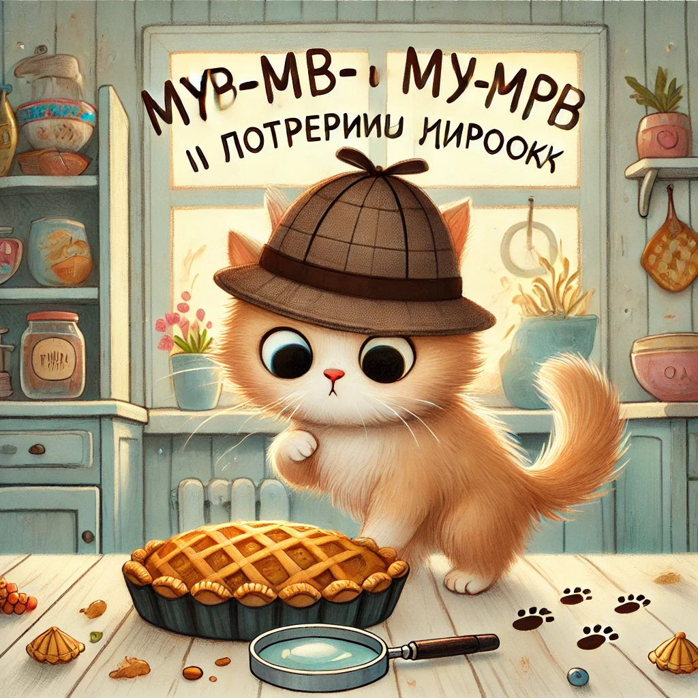

### **Lugu 2: Murr-murr ja kadunud pirukas**  

Hommikul oli Murr-tauni maja täis imelist lõhna — ema Murrka oli just küpsetanud **kaksteist kalapirukat** ja asetas need aknalauale jahtuma.

— Mitte näppida! — ütles ta rangelt, vaadates kassipoegi. — Kõigepealt lõuna, siis pirukad.

Murr-murr istus laua ääres, saba vehkimas, ja kujutas juba ette, kuidas pirukas hüppab talle ise sülle.

Aga siis…

— Emmeee! — hüüdis õde Mjauksa. — **Üks pirukas on kadunud!**

Aknalaual oli ainult **üksteist pirukat**. Üks oli selgelt puudu.

Ema ahhetas. Isa Murr, alati tõsine, sättis prille ja ütles:

— See vajab uurimist.

Aga Murr-murr juba tõmbas oma detektiivikaabu pähe (tegelikult isa magamismüts) ja kuulutas:

— Mina olen uurija Murr-murr! Ma lahendan selle juhtumi!

---

**Tunnistajate küsitlemine** algas.

— Mjauksa, kus sa hommikul olid?

— Ehitasin kastidest lossi, — vastas Mjauksa uhkelt, põll ees nagu printsess.

— Hmm… alibi olemas, — pomises Murr-murr ja kraapis oma "märkmikku" (ehk põrandale joonistatud tolmusesse ringi).

Seejärel läks ta venna Tiskase juurde, kes lösutas diivani all.

— Kas sa nägid pirukat?

— Pirukat? Ei… — venitas Tiskas, aga… liiga kiiresti limpsis huult.

**Kahtlane.**

Murr-murr uuris sündmuskohta. Põrandal oli **jahu**. Aknalaual — **väike käpajälg**, mis viis põrandale… ja sealt diivani alla.

Ta roomas diivani alla — ja seal, hämaras, olid **purukesed**, **salvrätitükk** ja… **pool kalatäit!**

— Tabatud, Tiskas! — hüüdis Murr-murr.

Tiskas ohkas ja tunnistas:

— See lõhnas nii hästi… Ma ei suutnud vastu panna… Ma mõtlesin, et keegi ei märka…

---

Ema Murrka tuli, paitas Tiskast ja ütles:

— Ma mõistan, pirukad on tõesti maitsvad. Aga ilma loata ei tohi võtta.

— Vabandust, emme, — pomises Tiskas, veidi kurvalt.

Ema naeratas ja pilgutas silma:

— Kuulge nüüd. Murr-murr, sa tegid suurepärast tööd. Aga nüüd… teeme koos **veel ühe laari pirukaid**, seekord väikese saladuse ja suure aususega!

Kogu pere kogunes kööki. Jahu lendles õhus, tainas kleepus käppade külge, ja Tiskas, pealaest sabaotsani jahune, vajutas südamekujulise mustri igale pirukale.

Ja Murr-murr istus taburetil, "märkmik" käpas, ning kirjutas oma **esimese lahendatud juhtumi** üles.
