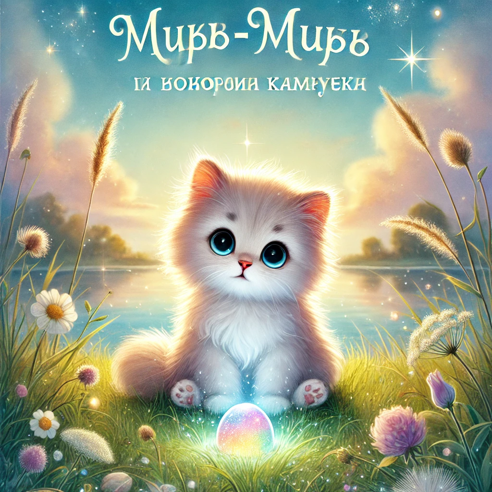

### **Lugu 3: Murr-murr ja rääkiv kivike**  

Sel päeval paistis Murr-taunis soe tuul, ja kassipojad otsustasid minna **piknikule Mjäukolli järve äärde**.

Ema Murrka pakkis korvi: karvane tekk, võileivad tuunikalaga, plüüsist karu ja väike termos piimaga.  
Murr-murr hüples ringi, kandes oma väikest õlgkübarat.

— Ainult järvest eemale, — ütles ema. — Ja ära söö kõiki võileibu enne, kui me kohale jõuame!

— Luban! — hüüdis Murr-murr ja kappas minema, korv hammaste vahel.

---

Piknik oli **täiuslik**.  
Kassipojad jooksid, mängisid, tegid saiatorni ja arutasid, kes hüppab kaugemale.

Aga siis märkas Murr-murr **midagi kummalist**:  
Üks **väike kivike**, ümara kujuga, sätendas kõigi vikerkaarevärvidega.

— Uuuu… — sosistas Murr-murr ja puudutas seda käpaga.

— *Tere,* — ütles kivike.

Murr-murr ehmus ja kargas õhku:

— Kes see oli?

— Mina. Kivike. Olen Mõtlik. Olen siin juba sada aastat ja kuulan maailma. Tahad vestelda?

---

Murr-murr istus vaikselt.

— Millele sa mõtled?

— Kõigele, — vastas kivike. — Näiteks… mida teha, kui tahad **pirukat süüa**, aga mitte kedagi kurvastada? Või kuidas teada, **mis on õige?**

Murr-murr mõtles.

— Täna Mjauksa solvus. Ma ei võtnud teda oma tornimängu. Aga ma ei tahtnud teda kurvastada…

— Kas sa rääkisid temaga sellest? — küsis kivike õrnalt.

— Ei… Ma lootsin, et ta saab aru ise.

Kivike helendas pehmelt.

— Mõnikord peab mõistmiseks **kuulama teise südant**. Proovi öelda, mida sa tunned.

---

Murr-murr jooksis tagasi teiste juurde ja sosistas Mjauksale:

— Vabandust. Ma tahtsin mängida üksi, aga sa oled mulle tähtis.

Mjauksa vaatas talle otsa… ja kallistas teda.

— Ehitame koos? Meil tuleb veel ägedam!

---

Tagasi jalutades vaatas Murr-murr kivikest… aga see **ei öelnud enam midagi**. Ta lihtsalt lebas vaikselt ja säras.

Aga Murr-murr **tundis** — kivike kuulas.  
Ja tema südamesse jäi **veel üks väike vastus**.
