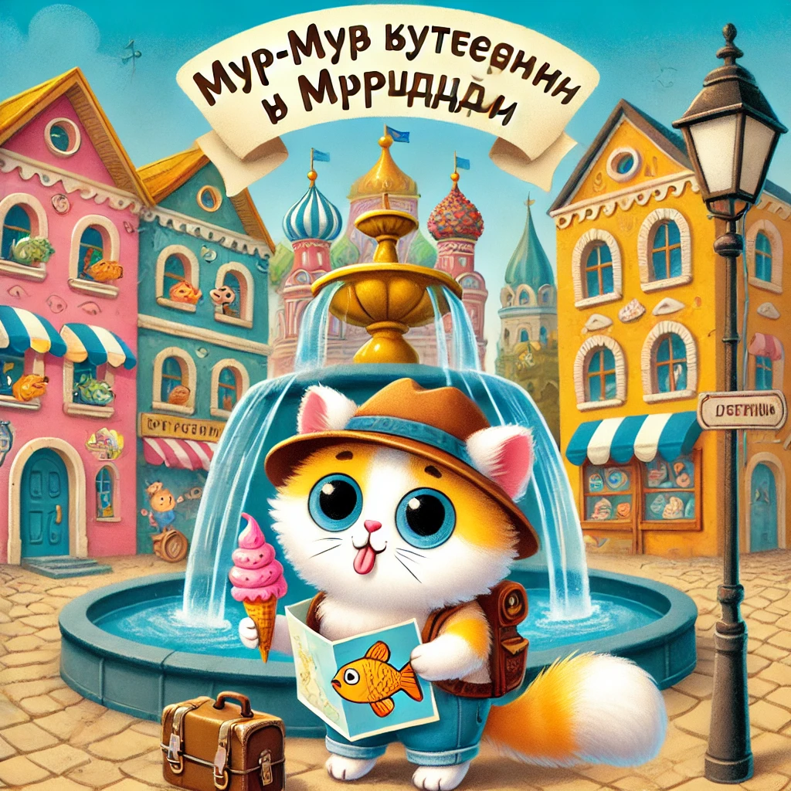

### **Lugu 9: Murr-murr reisib Murrvilli**  

Ühel hommikul ärkas Murr-murr, sirutas käpad ja… tundis, kuidas sees **miski põksus**.

— Emme! Issi! Täna on laupäev, eks?

— Just nii, — vastasid vanemad koos.  
— See tähendab, et täna ma **sõidan Murrvilli!**

See oli kingitus hea käitumise eest: abiks köögis, korrektselt kastetud uba, ja **peaaegu** mitte ühtegi kommi enne õhtusööki.

---

**Murrvill** oli kuulus kogu piirkonnas — linn, kus olid muusikapurskkaevud, raamatukogu torni sees ja… **Maailma Suurim Kassisfäär**!

— Kas sa ikka ei eksi ära? — küsis ema, sättides mütsi Murr-murri pähe.

— Muidugi mitte, — noogutas Murr-murr tähtsalt. — Mul on kaart, kompass ja… varusokk. Igaks juhuks.

---

Rong kihutas mööda rohelisi välju. Murr-murr nosis käpapiparkooke ja vahtis aknast välja.

Kui ta lõpuks jaamas maha astus, avanes tema ees tõeline… **vikerkaar-linn!**  
Kõik säras, liikus, lõhnas nagu seiklus.

---

Esimesena suundus ta **Noorte Uurijate Keskusesse**, kus talle anti:  
📘 *Reisija pass*  
🗺️ *Mänguline linnakaart*  
🎯 *Ülesannete nimekiri*:  
- Käi muuseumis  
- Leia Kuldkala  
- Söö jäätist kahe käpaga  
- Saada emale postkaart

— Alustan operatsiooni: *Karvas linnaretk*, — sosistas ta.

---

**Muuseumis** nägi ta esimest supikella kasside ajaloost.  
**Kuldkala** leidis ta purskkaevust Kalaplatsil — ta vilgutas silma!

**Jäätis** oli natuke külm, aga väga-väga hea — eriti tuunikalakastmega.

**Postkaart** jõudis emani juba poole tunni pärast:  
*“Olen turvaliselt kohal. Linn nurrub. Musid — uurija.”*

---

Viimaks, enne kojusõitu, istus Murr-murr **Põõsasisinas Pargis**, vaatas pilvi ja ohkas:

— Murrvill… sina oled tõeline avastus.

Käpakeses hoidis ta väikest münti:  
**"Sa olid siin. Sa nägid. Sa nurrusid."**

---

Kui ta koju jõudis, kallistas ema teda tugevasti, ja isa ulatas väikese medali:

— Julguse, uudishimu ja Kuldkalaga kohtumise eest!

— Ja ma tõin teile kingitusi! — hüüdis Murr-murr. — Ja… natuke jäätist. No… see sulas. Aga südamega!
