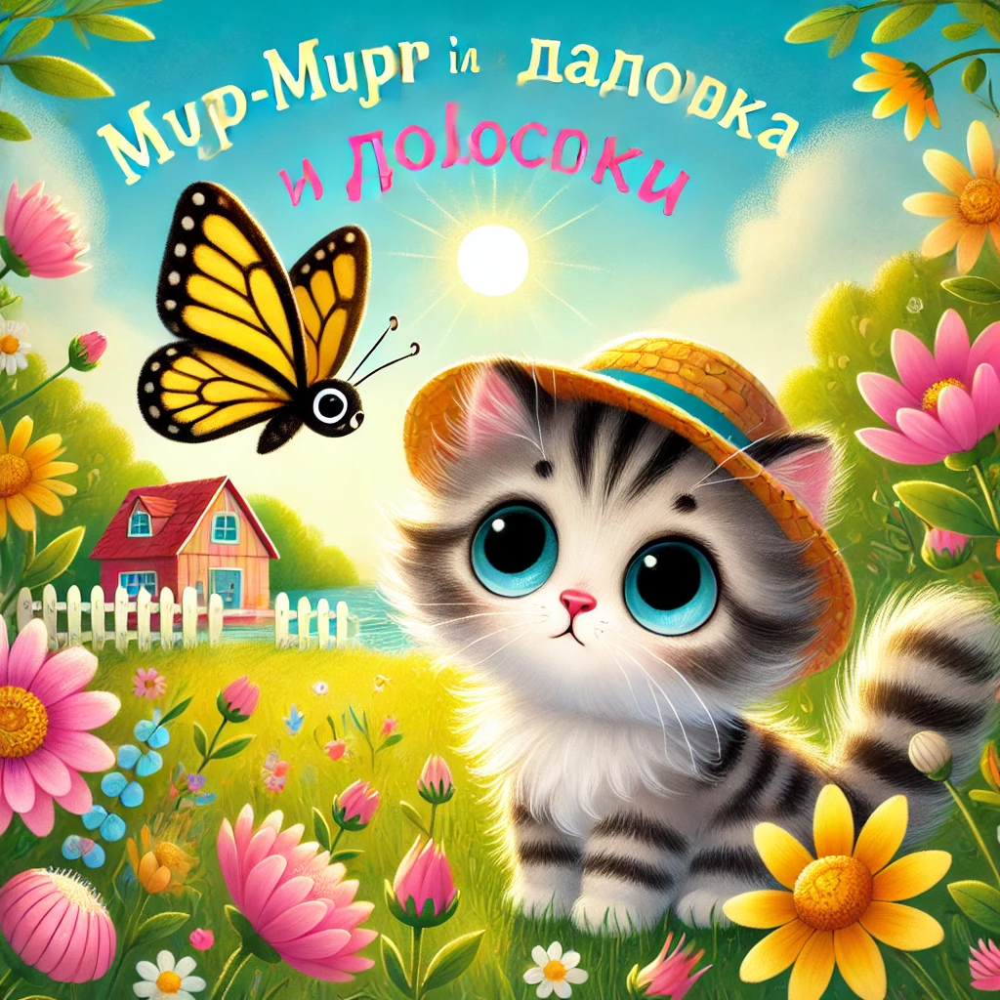

### **История 1: Мур-мур и бабочка в полосочку**

С утра в Муртауне светило солнышко и по воздуху разливался запах пирожков с рыбкой — мама Мурка только что достала их из духовки. В доме на берегу озера царило веселье: котята гонялись друг за другом, прыгали с подушек и строили башню из кубиков.

Но маленькому Мур-муру хотелось чего-то необычного.

— Мааам, можно я пойду в сад? Я буду очень осторожным! — мурлыкнул он, уже натягивая свою маленькую соломенную шляпку.

— Только недалеко, Мур-мур, и не мочи лапки в пруду! — крикнула мама Мурка из кухни, протирая пушистыми лапками стол.

Мур-мур выскользнул за дверь и сразу заметил её — **бабочку**! Она была полосатая, жёлто-чёрная, как маленький летающий шарфик. Она плавно порхала над цветами, а потом вдруг — взвилась ввысь!

— Подожди-и-и! — закричал Мур-мур и помчался за ней.

Он бежал по тропинке, проскочил мимо старого пенька, перепрыгнул через корни и... оказался в уголке сада, где ещё никогда не был.

В траве стоял **маленький домик из тыквы**.

— Мяу? — тихонько спросил Мур-мур.

Из домика выглянул **улитёнок в очках**.

— Привет! Ты кто? — спросил он тоненьким голосом. — Я Уллипуп, библиотекарь Сказочной Травы. А ты чего здесь?

— Я за бабочкой бежал... но, кажется, заблудился, — прошептал Мур-мур, оглядываясь.

— Не беда! — улыбнулся Уллипуп. — Я знаю короткую дорогу домой. Но сначала хочешь посмотреть мою коллекцию семечек?

Мур-мур кивнул. Он провёл у Уллипупа целых **пять кошачьих минут**, рассматривая семечки, слушая истории про травинки и угощаясь миниатюрным печеньем с мёдом.

Потом Уллипуп показал ему тропинку, ведущую прямо к задней калитке дома.

Когда Мур-мур вернулся, мама уже стояла у двери.

— Ты где был, мой хвостик? Я волновалась!

— Я встретил Уллипупа! Он живёт в тыкве и собирает истории про травинки! — засиял Мур-мур.

— О, это, наверное, тот самый Уллипуп, о котором мне рассказывала твоя бабушка, — сказала мама Мурка с улыбкой. — Значит, ты сегодня открыл первый волшебный уголок сада...

Мур-мур засмеялся и прижался к маме.

А бабочка в полосочку снова пролетела мимо и подмигнула.
