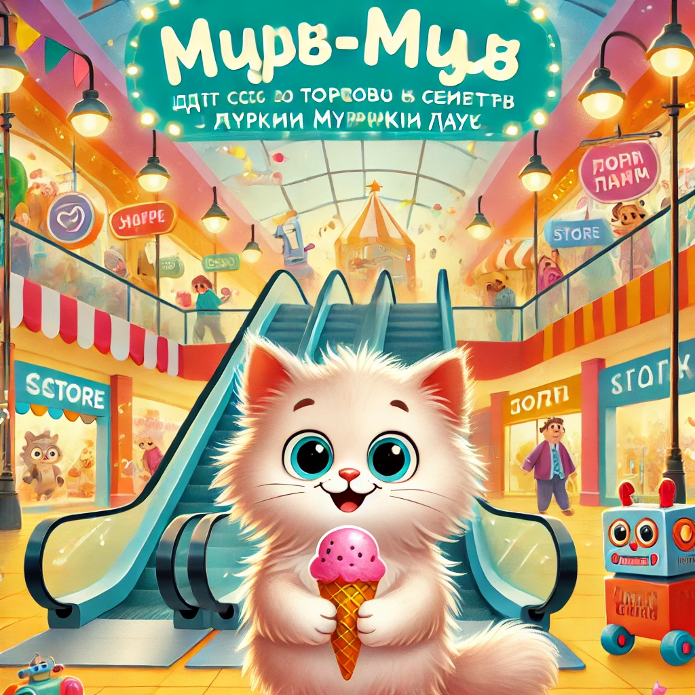

### **История 10: Мур-мур идёт с семьёй в торговый центр**

В воскресенье с самого утра в доме пахло ванильным мылом — все готовились к **походу в "Муркин Хаус"**, самый большой торговый центр в округе.

— У нас большая миссия! — заявил папа Мур, примеряя галстук с рыбками. — Нужно купить зимние варежки, новый термос и… торт!

— А ещё можно просто походить и помурлыкать, — улыбнулась мама Мурка, беря список покупок.

— А я хочу в магазин игрушек! — радостно подпрыгнул Мур-мур. — Там же есть **говорящий робот-кот!**

---

"Муркин Хаус" оказался **огрооомным**. Эскалаторы катили вверх и вниз, на стенах мигали вывески:  
**"ЛапкаStyle"**, **"Мур-мороженко"**, **"КотоКниги"**, **"Играй-Гав"**…

Мур-мур держал маму за лапу и пытался всё успеть разглядеть.

В магазине одежды он примерял шапку с ушками. В магазине сладостей — увидел зефир с глазами. А в магазине игрушек…

— Оооо! Это он! РобоКот-3000!

Робот помахал ему и мяукнул:

— Привет, Мур-мур. Я готов к мурозабавам!

Мур-мур был в восторге.

---

Но в какой-то момент, когда семья зашла в книжный магазин, Мур-мур, увлёкшись красивой витриной, **заглянул за угол… и потерял родителей из виду.**

Он остановился. Оглянулся. **Мамы нет. Папы тоже.**

— Эээ… Мяу?

Толпа ходила туда-сюда, лампочки мигали, кто-то смеялся…

Сначала Мур-мур испугался. Но потом вспомнил, что **мама учила: если потеряешься — не бегай, найди помощника.**

---

Он подошёл к стойке информации, где сидел **пёс-охранник с бейджиком "Боб"** и шляпой со звёздочкой.

— Простите… Я потерял маму…

Боб добродушно кивнул:

— Не бойся, малыш. Сейчас объявим. У нас такие ситуации — каждый час!

Через минуту из динамиков раздалось:

— Внимание, внимание! Маленький пушистик по имени Мур-мур ждёт свою семью у стойки информации. Он очень храбрый и немного голодный.

Через пару мгновений мама Мурка подбежала и **обняла его крепко-крепко**.

— Мур-мурчик! Ты правильно всё сделал! Я так тобой горжусь!

---

После этого Мур-мур получил бонус — **мороженое с двойной шапочкой** и **новую книжку про космических котов**.

— Ну что, домой? — спросил папа.  
— А можно… ещё раз прокатиться на эскалаторе? Просто вверх-вниз. Вверх-вниз. Много раз!

Все засмеялись. И прокатились. Вверх. И вниз. И ещё пару раз.

---

А вечером Мур-мур сказал:

— Сегодня я научился одному важному правилу: **если потерялся — не бойся, тебя обязательно найдут. Главное — ждать и мурлыкать спокойно.**

И папа добавил:

— А ещё… не отвлекайся на витрину с летающим зефиром!
