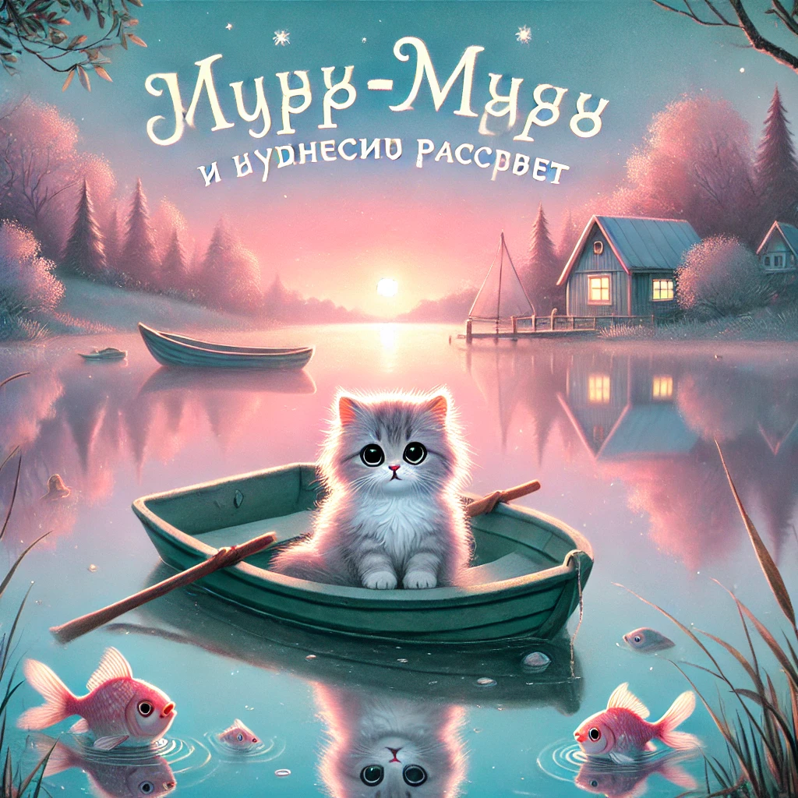

## **История 11: Мур-мур и чудесный рассвет**

Мур-мур проснулся очень рано. Было уже светло, но солнышко ещё только собиралось выглянуть из-за горизонта.  
Всё вокруг казалось волшебным — **летнее утро**, полное **звенящей тишины**, когда даже ветер шепчет вполголоса.

Он осторожно выбрался из своей уютной кроватки, стараясь не разбудить ни маму Мурку, ни папу, ни братьев и сестёр.  
Прыг-прыг — и он уже на мягкой траве возле дома.

Перед ним раскинулось **озеро Мяуколь** — гладкое, как зеркало.  
На берегу стояла **его маленькая лодочка**, привязанная к колышку. Мур-мур тихонько отвязал верёвку и оттолкнулся от берега.

---

**Небо было розово-голубым**, и в нём отражалась мечта.  
Мур-мур плыл к самому центру озера, и вода почти не шевелилась под лодкой. Всё было **очень тихо**.  
Даже птички ещё не начали петь. Только где-то далеко трещал одинокий кузнечик.

— Как красиво… — прошептал Мур-мур. — Это, наверное, самое спокойное утро в мире.

---

И вдруг…  
*Бульк!*

Из воды показалась **удивлённая рыбка**, затем ещё одна. Они молча смотрели на Мур-мура, будто спрашивали:  
— Кто ты такой, что нарушил наше утреннее зеркало?

Мур-мур улыбнулся.

— Я просто пришёл полюбоваться вместе с вами, — сказал он шёпотом.

---

Постепенно звуки начали просыпаться.  
Сначала **звонкий щелчок створки окна** в далёком доме.  
Потом — **шуршание метлы** у лавочника.  
Дальше — **топот лапок** по мостовой.

Город **оживал**.

Мур-мур услышал, как **мама Мурка зовёт** из дома:  
— Дети, подъем! Завтрак готов!

Он быстро повернул лодку и направился обратно к берегу.

---

У дома его уже ждали братья и сёстры — весёлые, сонные и слегка растрёпанные.

— Где ты был? — удивились они.

— Смотрел, как просыпается мир, — сказал Мур-мур. — Он сначала спит в зеркале. А потом… улыбается.

И вскоре вся большая семья сидела за столом, а Мур-мур ел свой завтрак, радуясь, что в его день уже поместилось **маленькое чудо**.
