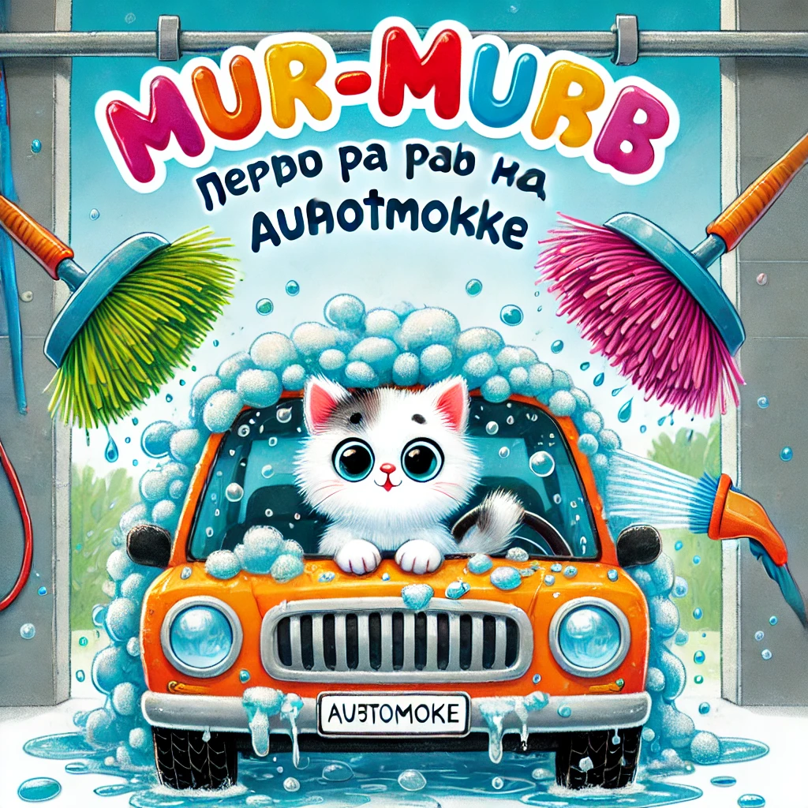

### **История 12: Мур-мур первый раз на автомойке**

— Мур-мур, надевай шапку, мы едем **на автомойку**! — сказал папа Мур, хлопая себя по бокам. — Машина вся в пыли, как будто скакала по пустыне!

— На автомойку? — переспросил Мур-мур, расправляя усы. — Это туда, где всё шипит, пузырится и всё в пене?

— Именно! — подмигнул папа. — Будешь моим штурманом.

---

Путь был недолгим, но очень волнительным.  
Мур-мур сидел на заднем сиденье, жевал мягкое рыбное печенье и изо всех сил **глядел в окно**, чтобы не пропустить ни одной автомойки.

И вот — **она!**

Большая, стеклянная арка с надписью **«МяуМойка 3000»**. Перед входом стояли **другие машины**, и внутри всё **жужжало, шипело и сверкало**.

— Мы в очереди, — сказал папа. — Сейчас заедем внутрь!

Мур-мур притих.

— А оно… не больно? — прошептал он.

Папа улыбнулся:

— Совсем не больно. Это как душ, только для машины. И с очень толстыми щётками!

---

Очередь двигалась.  
Мур-мур глядел, как одна за другой машины **заезжали внутрь**… и пропадали в мыльной пелене.  
Там что-то крутилось, мигало, **вода лилась**, щётки вертелись как огромные цветы.

И вот — **их очередь.**

Машина медленно въехала под арку. Мур-мур вжался в сиденье.

— Сначала будет мокро. Потом будет мыльно. А потом будет чисто! — объяснил папа.

---

*Шшшш… БУУУМ!*

Поток воды ударил в лобовое стекло. Мур-мур взвизгнул — но тихо.

— Всё нормально! — подбодрил папа.

Потом сверху **посыпалась пена** — белая, розовая, как клубничный торт.  
**Большие круглые щётки** начали крутиться и скользить по стеклу, по крыше, по дверям…

— Ух ты… они как огромные лапки! — прошептал Мур-мур.

Щётки жужжали, пена стекала, а потом… включились **фен-сушилки** — и машина оказалась в **пузырчатом туннеле ветра**!

---

— Всё! — сказал папа. — Мы снова сверкаем!

Мур-мур выдохнул и сел ровнее.

— Это было страшновато… но весело!

— Вот именно. Иногда новое может шуметь и пугать. Но если ты рядом — ничего не страшно, — сказал папа, и дал ему маленькую шоколадную рыбку.

---

А когда они ехали домой, Мур-мур задумчиво сказал:

— Пап, а можно как-нибудь… я сам за рулём поеду на автомойку?

Папа рассмеялся:

— Конечно! Только сначала вырасти. И получи лиценмяу.
