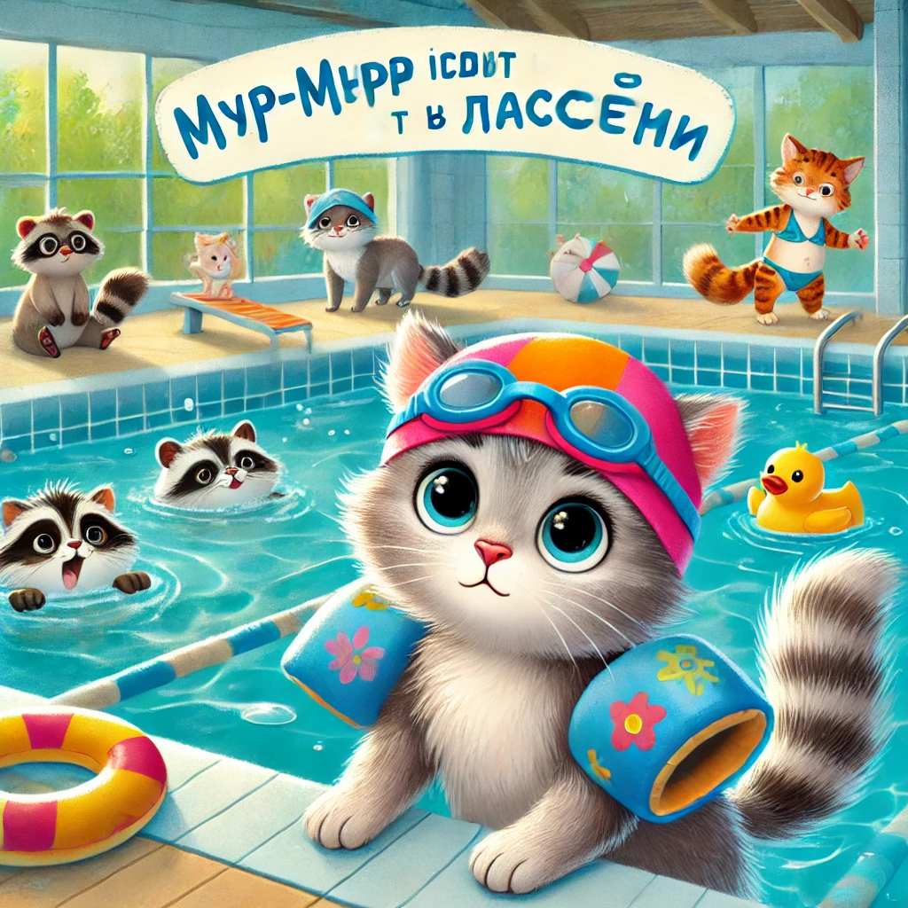

### **История 14: Мур-мур идёт в бассейн**

— Мур-мур, просыпайся! Сегодня особенный день! — позвала мама Мурка с кухни.  
— У нас в планах… **поход в бассейн!**

Мур-мур приподнял ушки.

— В бассейн? С водой? Настоящей?! — он замер, потом радостно подпрыгнул, а потом снова замер.  
— А там… нужно плавать? А если я утону?

— Ты не утонешь, — ласково сказала мама. — Там мелко, а я буду рядом. И папа. И… у тебя будут **плавательные рукавчики с рыбками!**

---

В рюкзак Мур-мур положил:  
✔️ полотенце,  
✔️ тапочки,  
✔️ очки (на всякий случай),  
✔️ и своего плюшевого морского конька по имени **Буль-Буль**.

Когда они пришли, бассейн был **огрооомный** и **голубой, как небо с утками**. Коты и кошки разных возрастов плескались, ныряли, хохотали, кто-то катался по водной горке.

Мур-мур прижался к маме.

— А вдруг вода холодная? Или очень мокрая?

— Она именно такая — мокрая, — улыбнулся папа. — А ты — очень смелый!

---

Мур-мур надел шапочку. Она была чуть великовата и съехала на глаза.

— Ты похож на морскую капусту, — сказал папа.  
— А ты — на морского кита! — хихикнул Мур-мур.

И вот он ступил в воду…

Сначала лапкой. Потом ещё одной. Потом по колено.  
— Она... **тёплая!** — удивился Мур-мур.

А потом — **плюх!** — и он оказался в воде по уши, мама рядом, а рукавчики уверенно держат его на плаву.

---

Скоро он уже нырял, доставал игрушечного дельфина со дна и смеялся так громко, что даже старенький спасатель-барсук заулыбался.

— Мам! Пап! Смотрите! Я — мур-дельфин!

— А я — мур-краб! — крикнул папа, поливая всех из игрушечного ведёрка.

---

Когда настало время вылезать, Мур-мур сказал:

— Можно ещё чуть-чуть? Ну ещё один заплыв?

— Мы обязательно придём снова, — пообещала мама, заворачивая его в мягкое полотенце с ракушками.  
— Ты сегодня был настоящим котёнком-пловцом!

— Мур-мур-дадыр! — засмеялся он.

---

А вечером он уже почти засыпал, когда прошептал:

— Мама… а во сне я тоже могу плавать?

— Конечно. И без шапочки, — ответила мама и поцеловала его в мокрый носик.
