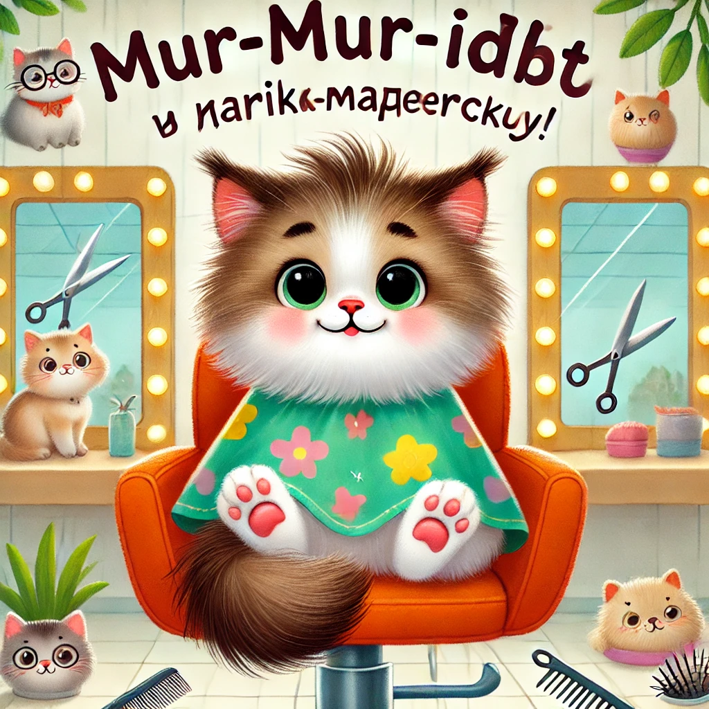

### **История 15: Мур-мур идёт в парикмахерскую**

— Мур-мур, пора на стрижку! — сказала мама Мурка, заглянув под стол. — У тебя на ушах уже маленькие облака!

— Но мне нравится быть пушистым… — пробормотал Мур-мур, прижимая лапками уши. — Я как тучка! Или как пирожок!

— Ты и после стрижки останешься чудесным пирожком, — улыбнулась мама. — Просто с аккуратными ушками.

---

Парикмахерская «**Мяу и Чёлочка**» была уютной.  
На стенах висели зеркала, в углу журчал фонтанчик, и кто-то мурлыкал мелодию, пока большой полосатый мастер — **стилист Барсик** — точил ножницы.

— Кто у нас сегодня? — спросил он.

— Это Мур-мур. Первый раз.

— Ах, первый раз — это важно! — Барсик кивнул. — Я обещаю: не кусается, не щиплет и… только чуть-чуть щекочет!

---

Мур-мур забрался на мягкое кресло. Оно **поднималось вверх**, потом **немного повернулось**, и он увидел себя в зеркале.

— Это точно я? Я такой лохматый!

— Пока что, — сказал Барсик, повязывая ему пёстрое покрывальце.

Сначала был **распылитель** — *пшшш!* — немного прохладно, но не страшно.

Потом **расчёска** — *шур-шур-шур*, щекотно за ухом!

А потом — *щёлк!*… *щёлк!*… *щё-о-о-лк!* — ножницы!

---

Мур-мур замер.  
— Это точно не уши?

— Точно. Я знаю, где заканчивается кот и начинается воздух, — подмигнул Барсик.

Пушок летел в воздухе, кружился, как снежинки. Один даже сел Мур-муру на нос.

— Апчхи! — чихнул он и расхохотался.

---

Через несколько минут всё было готово.

— Вот и всё! — сказал Барсик. — Смотри, какой красавец!

Мур-мур посмотрел в зеркало… и не узнал себя.

— У меня… у меня теперь вид, как у взрослого кота!

— Только в ушах всё равно малыш, — шепнула мама и обняла его.

---

На выходе Барсик дал ему маленький бонус — **пушистую кисточку на резиночке**.

— Это тебе — на память о первом мур-стайле.

---

А вечером Мур-мур разглядывал себя в зеркале снова.

— Может, завтра мне сделать ирокез?.. Или завивку?..

— Только сначала — в школу! — послышался мамин голос из кухни.
