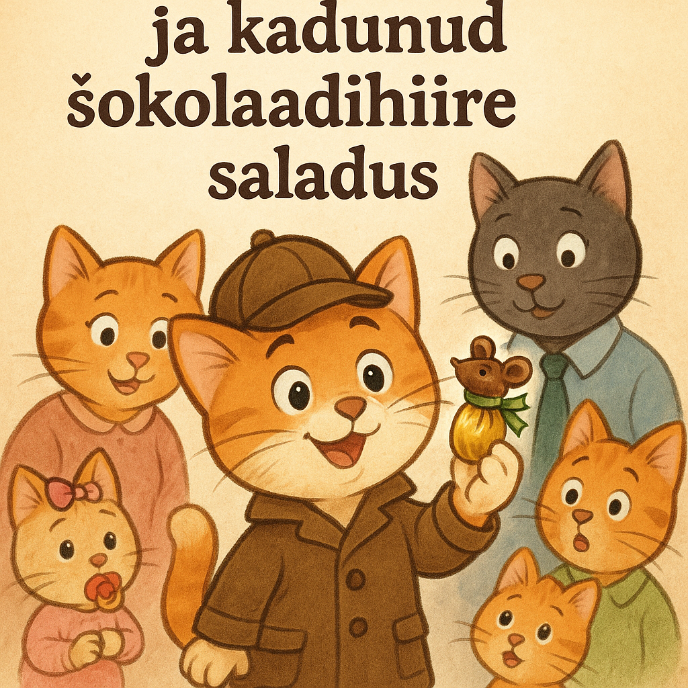

### **История 17: Мур-мур и дело о пропавшей конфете**

В доме витал запах праздника. Вся семья готовилась к вечернему торжеству: учебный год подошёл к концу, и мама Мурка пообещала сюрприз — шоколадные мышки, по одной на каждого.

Мур-мур заметил, как мама прятала красивую коробку на верхнюю полку кухни.

— Сегодня вечером — сладкий подарок! — сказала она. — Но пока не трогать!

Весь день в доме царило веселье. Кто-то играл, кто-то рисовал, а малышка Соня, как всегда, сосала соску и наблюдала за всеми, глядя огромными глазами.

Наконец, наступил вечер. Все собрались в гостиной: папа Мур, Тишка, Барсик, Мяуся, Соня и, конечно, сам Мур-мур — в своей сыщицкой шляпе, которую он носил просто потому, что считал себя настоящим наблюдателем.

Мама принесла коробку.

— Сейчас каждому достанется по шоколадной мышке! — с улыбкой объявила она. Но когда открыла коробку, её глаза округлились.

— Ой... нас шестеро, а мышек всего пять!

— Наверное, одна убежала! — засмеялись Тишка и Барсик.
— Или испугалась, что её съедят, — хихикнула Мяуся.

Но Мур-мур нахмурился.

— Нет. Шоколадные мышки не убегают. Здесь явно что-то не так.

Он встал прямо в центре комнаты.

— Это дело требует расследования. Я всё выясню.

Сначала он расспросил всех по очереди.
Папа Мур сказал, что весь день помогал чинить полку в кладовке и конфеты даже не видел.
Мяуся читала книгу в своей комнате.
Тишка весь день мастерил картонный замок.
Барсик спал в кресле под пледом.
А малышка Соня только посасывала молочко и гулила себе под нос.

У всех были свои занятия, никто не выглядел подозрительно. Мама вздыхала:

— Я точно покупала шесть шоколадных мышек...

Мур-мур посмотрел на неё. Что-то не сходилось.

— Мама, давай вспомним вместе, что ты делала после магазина?

— Я пришла домой, — сказала мама, задумчиво вспоминая, — потом достала продукты, разложила их. Конфеты переложила в коробку и поставила её на кухонную полку… а потом весь день мы готовились к празднику.

Мур-мур прищурился.

— Подожди… А ты пересчитывала мышек, когда переложила их в коробку?

— Нет… — мама нахмурилась. — А зачем? Я же считала их в магазине.

— Вот оно! — воскликнул Мур-мур и сорвался с места.

Он молнией помчался в коридор, где висела мамина сумка.

Все бросились за ним.

Он встал на задние лапки, сунул лапку в сумку, немного порылся и…
достал шестую шоколадную мышку, всё ещё в обёртке и с бантиком.

— Нашлась! — сказал он с улыбкой. — Она просто осталась в сумке, когда ты пришла домой.

— Ну надо же… — рассмеялась мама. — Спасибо, детектив Мур-мур!

— Настоящий сыщик! — сказали все хором.
— Герой вечера! — добавила Мяуся.

Праздник продолжился. Каждому досталась своя мышка, и никто не был обижен.
А Мур-мур сидел в своём кресле, ел конфету и записывал в блокнотик:

"Дело о мышке в сумке — раскрыто. Шоколад на месте. Праздник спасён."
