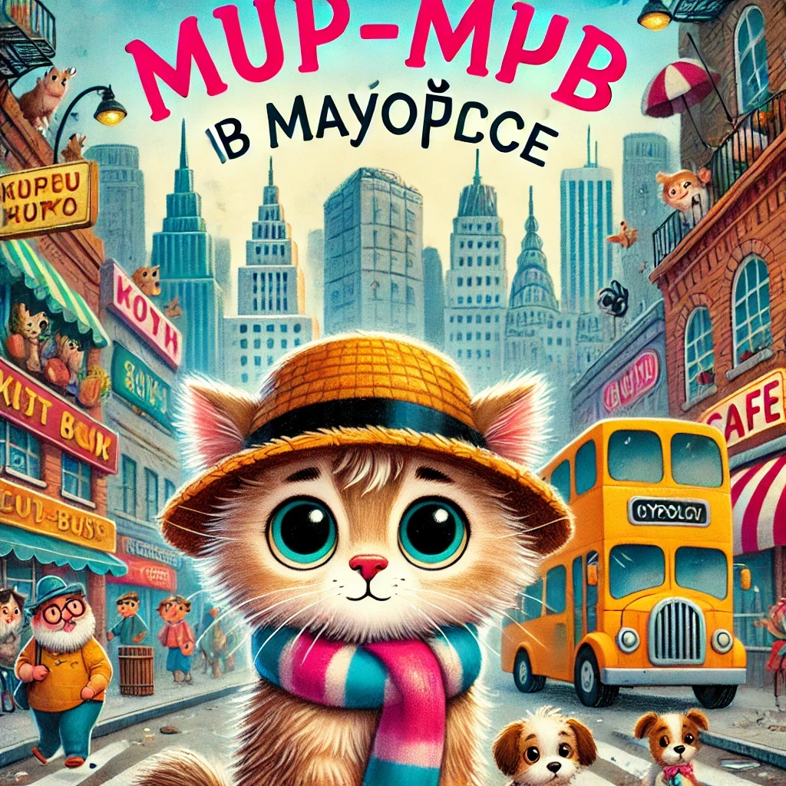

### **История 4: Мур-мур в Мяуполисе**

Утро началось, как обычно: в доме пахло овсянкой с рыбьим жиром, мама Мурка складывала бельё, а папа Мур собирался на работу в большой город **Мяуполис**.

— Мур-мур, не забудь полить свою фасоль! — сказала мама, выглядывая из-за стопки полотенец.

— Хорошо-о-о! — отозвался Мур-мур, но его мысли были далеко. Он стоял у окна и наблюдал, как **автобус номер 5** мягко покачивается на повороте и уезжает в сторону города.

Он **обожал автобусы**. Особенно, когда в них тихо гудит мотор, а сиденья такие мягкие…

---

Через полчаса мама зазвонила в сад:

— Мур-мур! Где ты?

Но Мур-мура **не было**. Потому что в это время он уже **сидел на самом заднем сиденье автобуса**, обнимая свою шляпу от ветра и мурлыча песенку под нос.

Он просто хотел прокатиться пару остановок… но **засмотрелся в окно**, потом заулыбался котёнку с бантиком напротив, а потом…

— Конечная! Мяуполис, Центральная площадь! — объявил водитель.

Мур-мур подпрыгнул.

— Ой! Я... в Мяуполисе?! Один?!

---

Вокруг было **огромно**. Высокие дома, машины, реклама с котиками в очках, и даже летающие дроны-доставщики.

Но Мур-мур не испугался. Он **очень любил исследовать**. Он поправил шляпу, достал свою маленькую карту и сказал:

— Хм… Почему бы и нет? Посмотрим, что тут у вас, Мяуполис!

---

Сначала он зашёл в **кафе "Мурр-латте"**, где ему налили маленькую чашку молока с пенкой в форме сердечка.

Потом он нашёл **книжный автомат**, где вместо билетов выдавались сказки. Он взял одну про Песца-Почтальона.

А потом он услышал:

— У-у-у... мяу...

Он обернулся и увидел маленького **щенка в полосатом шарфе**, сидящего на скамейке и тихо всхлипывающего.

— Что случилось? — спросил Мур-мур, присев рядом.

— Я потерял бабушку... Мы приехали из Мурвилля, и теперь я не знаю, где она...

Мур-мур задумался.

— У меня есть план!

---

Он взял щенка за лапу и повёл его к ближайшему **пункту находок**, где работала добрая киса с бейджиком.

— Бабушка щенка, пожалуйста, срочно к Стойке №2! — прокричала она в микрофон.

Через минуту прибежала бабушка с вязаными ушками и обняла щенка так крепко, что у него шапка сдвинулась на нос.

— Спасибо, милый котик! — сказала она Мур-муру. — Как тебя зовут?

— Мур-мур. Исследователь.

---

А потом...

— Мур-мур! — раздался голос. — Вот ты где!

Это был **папа Мур**, весь взволнованный, в костюме, с портфелем и каплей пота на лбу.

— Я услышал по радио, что "маленький котёнок в шляпе спас щенка в Мяуполисе"! Я сразу понял — это ты.

Мур-мур улыбнулся:

— Пап, тут так интересно!

Папа рассмеялся, взял Мур-мура на лапы и сказал:

— Ну что ж, Мур-мур. Сегодня ты был **самым настоящим городским героем**.

---

И по дороге домой в автобусе Мур-мур уже почти задремал, шепча:

— Надо будет съездить сюда ещё раз… может, в музей мышеловок? Или на башню Кота-наблюдателя...
