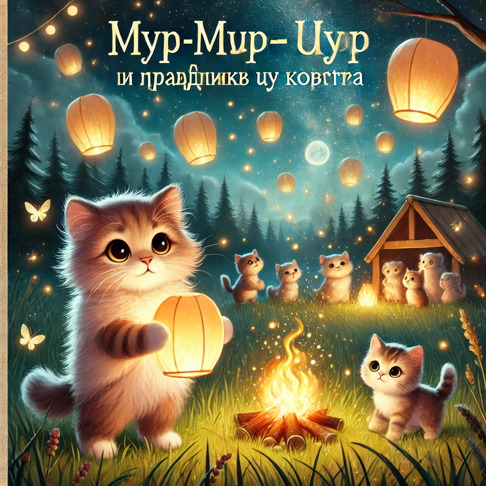

### **История 5: Мур-мур и праздник у костра**

Наступил последний день лета, и в Муртауне все котята с нетерпением ждали особого события — **Праздника Светлячков**.

Каждый год в этот вечер на поляне у леса собирались семьи, разводили костёр, пекли зефирки на палочках и запускали в небо **фонарики желаний** — маленькие светящиеся шары, похожие на звёзды, которые можно потрогать.

— Сегодня будет чудо! — сказал папа Мур, заплетая себе усы.  
— Только если загадаешь самое доброе желание, — подмигнула мама Мурка, надевая свою праздничную накидку.

---

Мур-мур с утра делал фонарик. Он хотел, чтобы его был самым красивым. Он вырезал узор в форме хвоста, приклеил блёстки, даже нарисовал на боку улыбающееся облачко.

— Готово! — гордо сказал он.

Но когда пришло время идти на поляну, **где-то по пути фонарик выпал из рюкзака… и исчез.**

Мур-мур запаниковал. Он обыскал всю тропинку, кусты, даже заглянул под пенёк (вдруг его кто-то спрятал?) — но ничего.

На поляне уже раздавался смех, фонарики взмывали в небо — один за другим. А он стоял с пустыми лапками.

---

И вдруг рядом кто-то всхлипнул.

Это был **малыш из соседнего дома, Пушик**, совсем крошечный котёнок, который прижал к себе какой-то комочек бумаги.

— Я порвал свой фонарик… — всхлипывал он. — А я хотел загадать, чтобы мама выздоровела...

Мур-мур замер.

Он посмотрел на малыша — растерянного, грустного, с мокрыми от слёз усами.

И тогда...

— Подожди меня, — сказал Мур-мур и побежал к своим родителям.

Через пару минут он вернулся с **сюрпризом** — **новым фонариком**, который мама Мурка сделала на всякий случай, «вдруг кто-то забудет».

Он отдал его Пушику.

— Вот, держи. Загадай своё желание — и оно обязательно долетит до звезды.

---

Когда фонарик Пушика взлетел в небо, он светился особенно ярко. Все замерли. Даже старый сова-барабанщик приостановил игру.

— Кто-то очень хорошо загадал, — прошептал кто-то.

Мур-мур улыбался. Без своего фонарика. Но с **тёплым огоньком внутри.**

А потом мама обняла его и прошептала:

— Знаешь, сынок… Иногда, чтобы зажечь звезду — не нужно её запускать. Нужно просто поделиться светом.

И на небе, как будто в знак согласия, **вспыхнула настоящая звезда.**
