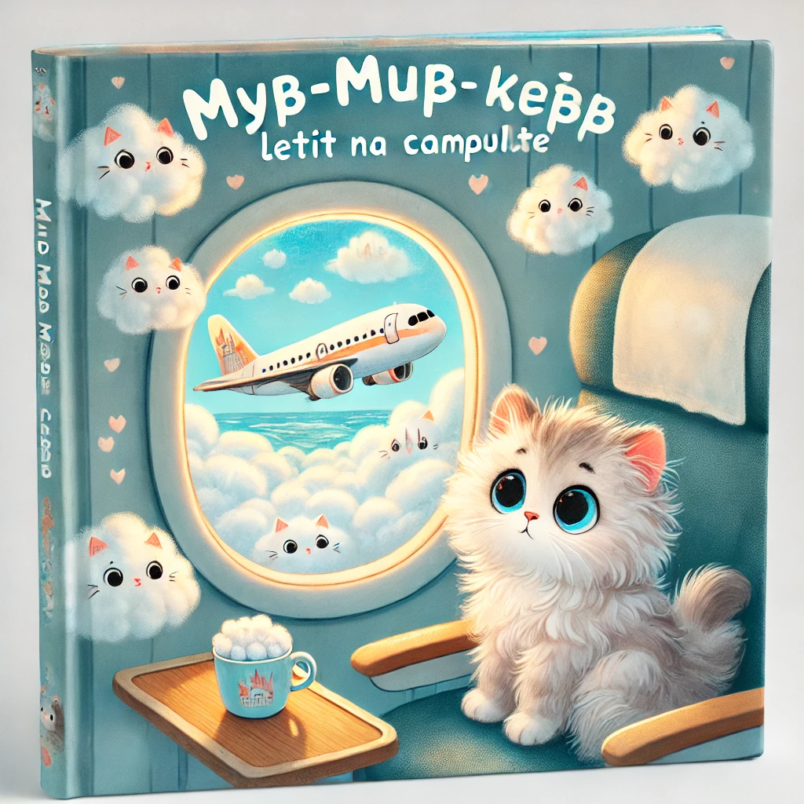

### **История 6: Мур-мур летит на самолёте**

Утро выдалось особенным: мама Мурка бегала по дому с чемоданами, папа Мур гладил усы и проверял билеты, а котята прыгали на чемоданах, как на батуте.

— Мы летим в путешествие! — радостно объявила мама.  
— На самолёте! — добавил папа.  
— Самолёт? — переспросил Мур-мур и... чуть не спрятался под кресло.

Он **никогда раньше не летал**. И если честно... немного **боялся**.

— Он большой? Он шумный? А если он вдруг… упорхнёт без нас?

Мама присела рядом и мягко погладила его по голове:

— Не бойся, Мур-мурчик. Самолёты созданы, чтобы **плавно летать**, как большие белые птицы. А ты будешь сидеть у окошка и смотреть на облака!

---

В аэропорту всё казалось **огромным**: зал ожидания, табло с мигающими буквами, коты в костюмах с чемоданами на колёсиках...

— Рейс Мяу-745 до Лапландии, посадка началась! — прозвучало из динамиков.

Мур-мур крепко держал маму за лапу, пока шёл по трапу. Он увидел **огромный блестящий самолёт**, как рыба-молния, готовую взлететь.

— Добро пожаловать на борт! — улыбнулась бортпроводница в форме, с именем **КисаЛюкс**. — Вот ваше место. И окошко — как раз для тебя.

---

Когда самолёт оторвался от земли, Мур-мур зажмурился, а потом осторожно открыл один глаз.

— Мама… **мы выше деревьев**!

А потом — **выше облаков**. За окном всё стало мягким и белым, как огромная подушка.

— Мама, там облачный замок! А вон — овечка! И котик с крыльями!

— Это твоя фантазия, сынок. Её никто не отменял на высоте!

---

Через минуту пришла бортпроводница.

— Хотите сок или молочко?

— Сок! — выпалил Мур-мур. — Но можно… в детском стаканчике?

Она улыбнулась и протянула стакан с нарисованными лапками и ушками.

— Ты у нас особенный пассажир.

---

Папа дремал. Мама читала журнал. А Мур-мур смотрел в окно и думал:  
**"Я лечу. Я настоящий путешественник. И… это совсем не страшно. Даже наоборот — круто!"**

---

Когда самолёт начал снижаться, Мур-мур чуть грустно вздохнул.

— А мы ещё когда-нибудь полетим?

— Конечно, — ответил папа. — Мы теперь летающая семья!

И Мур-мур знал: он **ещё не раз увидит облачного котика с крыльями**. Потому что теперь — **ему всё по лапке**.
