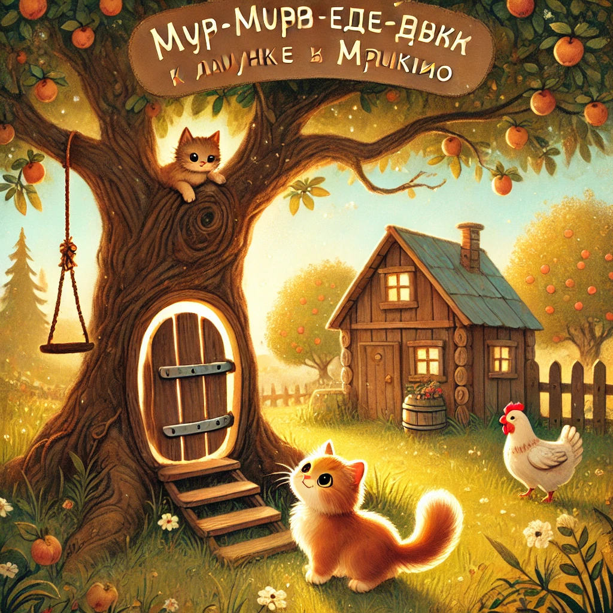

### **История 7: Мур-мур едет к бабушке и дедушке в Мяукино**

— Мур-мур, собирай рюкзачок, мы едем к бабушке и дедушке! — сказала мама Мурка, сворачивая шарф и пряча в него баночку с вареньем.

— В Мяукино? Ураа! — подпрыгнул Мур-мур. — Там же… яблони! И курицы! И деревенский пирог с рыбкой!

Папа Мур рассмеялся:

— И не забудь — там *нет интермяута*, зато **есть настоящие приключения**.

---

Поезд до Мяукино медленно качался по рельсам. За окном проплывали поля, реки, мельницы и коровы с бантиками. Мур-мур прилип к стеклу, а мама шептала:

— Сейчас будет туннель! Раз, два, три — *темнотаа-а!*

Котёнок захихикал, а когда свет снова вернулся, поезд уже подъезжал к станции.

На платформе стояли **бабушка Мурлыса** в фартуке с ромашками и **дедушка Муррей** с тростью из старого хвоста. Они обняли Мур-мура так крепко, что у него задребезжал ошейничек.

— Вот ты и подрос, хвостик! — промурлыкала бабушка. — Пойдём, у нас уже пирог дышит.

---

В деревне всё было иначе.

Тишина. Солнечные лучи сквозь листья. Запах печёной травы.

Мур-мур бегал босыми лапками по тропинкам, кормил курочек, гладил козу Мотю, а потом дедушка сказал:

— А хочешь, покажу тебе **секретное дерево**?

Мур-мур замер:

— Конечно хочу!

---

Они прошли через сад, миновали огород, потом пролезли под арку из веток — и там стояло оно. Огромное, старое, шершавое, с качелями на ветке и дверцей у корней.

— Это **Дерево Историй**. Когда я был маленький, я засовывал туда записки. И оно хранило мои мечты.

— А можно мне? — прошептал Мур-мур.

— Можно. Только не говори вслух, что загадаешь. Пусть дерево услышит первым.

---

Мур-мур достал листочек, написал там своей лапкой (немного криво):  
*“Хочу стать настоящим исследователем. Как папа. И дедушка. И вообще.”*

Он свернул записку и аккуратно положил её в трещинку у корней.

А потом... услышал **лёгкое шуршание листвы**. Как будто дерево улыбнулось.

---

Вечером, укутавшись в плед, с чашкой молока и печеньем, он сидел на крыльце рядом с бабушкой и дедушкой. Звёзды мерцали, кузнечики пели свою песню, а в сердце у него было тихо и тепло.

— Я сюда ещё приеду, — прошептал он. — Тут сказки живут прямо в воздухе.

Бабушка кивнула и улыбнулась:

— А ты, мой Мур-мурчик, и сам уже одна из них.
